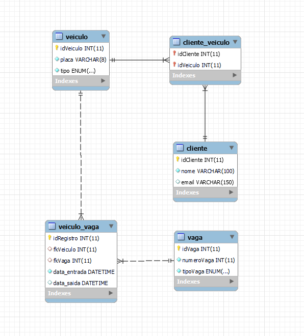

# Desafio SQL — Sistema de Estacionamento 🚗🏍️

## Estrutura do Desafio

O desafio está dividido em **3 blocos**, contemplando os comandos DDL, DML e DQL. Cada bloco tem questões práticas e uma pontuação específica. Os alunos devem apresentar o desenvolvimento no GitHub e compartilhar a tela para verificação do uso de IA.


Para organizar seu repositório siga o seguintes passos:
### 1. 🍴 Crie um novo repositório no seu GitHub
- Crie um novo repositório 
- Dê um nome ao repositório de 'Desafio SQL'.
- **Não** adicione README, `.gitignore` ou licença (para evitar conflitos).
- Crie o repositório e **copie a URL SSH ou HTTPS** do seu repositório novo.
### 2. ⬇️ Clone o repositório original
Abra o terminal e execute:

```bash
git clone https://github.com/techcomkathia/desafioFinalSQLlive06.git
cd repositorio-exemplo
```
### 3. Configure o repositório clonado para o seu repositório da atividade recém criado.
Verifique o remoto atual:

```bash
git remote -v
```
Remova o origin antigo
```bash
git remote remove origin
```

Adicione seu repositório (copiado do GitHub anteriormente):

```bash
git remote add origin https://github.com/seu-usuario/seu-repositorio.git
```

Verifique se foi adicionado corretamente:

```bash
git remote -v
```


### 4. Estruturando o banco.

Crie um arquivo com a extensão sql para inicar o desafio considere o SQL das tabelas :

```sql

CREATE TABLE cliente (
  idCliente INT AUTO_INCREMENT PRIMARY KEY,
  nome VARCHAR(100) NOT NULL
);


CREATE TABLE veiculo (
  idVeiculo INT AUTO_INCREMENT PRIMARY KEY,
  placa INT NOT NULL,
  tipo ENUM('carro', 'moto') NOT NULL
);


CREATE TABLE vaga (
  idVaga INT AUTO_INCREMENT PRIMARY KEY,
  numeroVaga INT NOT NULL,
  tipoVaga ENUM('normal', 'deficiente', 'idoso', 'gestante') NOT NULL
);

```

---

# 📊 Total de Pontos: 100

- Bloco 1 (DDL): 40 pts  
- Bloco 2 (DML): 30 pts  
- Bloco 3 (DQL): 30 pts  

---

> Os alunos devem versionar os arquivos no GitHub e apresentar os scripts na ordem dos blocos, com correção ao vivo.
Conforme os blocos forem finalizados, as questões dos blocos seguintes serão incluídas. 

# 🧱 Bloco 1 — DDL (40 pontos)





**Questão 1 (12 pts)** — texto em breve
**Questão 2 (12 pts)** — texto em breve
**Questão 3 (8 pts)** — texto em breve
**Questão 4 (8 pts)** — texto em breve

---

# 🧾 Bloco 2 — DML (30 pontos)

**Questão 1 (10 pts)** — texto em breve
**Questão 2 (6 pts)** — texto em breve
**Questão 3 (6 pts)** — texto em breve
**Questão 4 (8 pts)** — texto em breve
---

# 🔍 Bloco 3 — DQL (30 pontos)

**Questão 1 (5 pts)** — texto em breve
**Questão 2 (6 pts)** — texto em breve
**Questão 3 (6 pts)** — texto em breve
**Questão 4 (8 pts)** — texto em breve
**Questão 5 (5 pts)** — texto em breve

---


